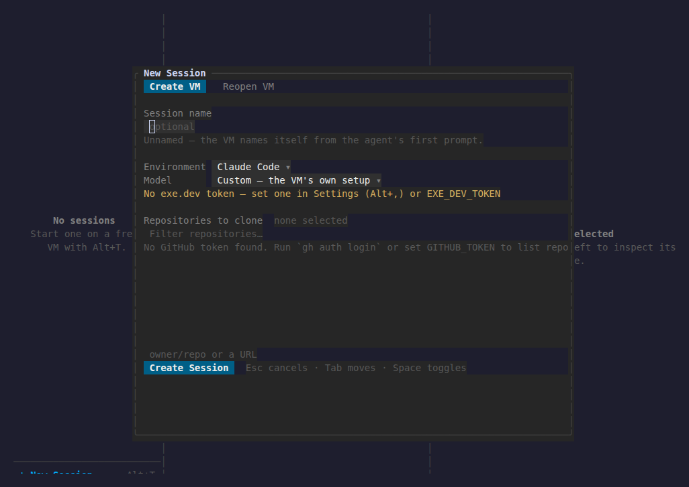

# hub

A terminal workspace for coding agents on ephemeral cloud VMs. Each session
opens a fresh VM on **[exe.dev](https://exe.dev)**, **[sprites.dev](https://sprites.dev)**
or a **[Namespace](https://namespace.so) dev box**, connects over SSH or that
provider's CLI, and drives the VM's tmux from the outside — every tmux window and
pane is its own tab. No tmux status bar, no prefix keys, no remote shell
pretending to be your terminal.



## Install

**Prerequisites:** Deno 2.x, and an account with a VM provider (exe.dev,
sprites.dev, or Namespace).

```
deno install --global -n hub -f \
  --allow-read --allow-write --allow-env --allow-net --allow-run --allow-sys \
  src/main.ts
```

Then run `hub`. Or run directly without installing:

```
deno task start
```

## First session

1. Set up whichever providers you use. **Settings** (`Alt+,`) holds the tokens
   and shows whether each one is ready.
   - exe.dev → `EXE_DEV_TOKEN` (needs `new`, `ls`, `rm`, `integrations`, `ssh-key` perms)
   - sprites.dev → `SPRITE_TOKEN` (and the `sprite` CLI installed locally)
   - Namespace → no token: install the `devbox` CLI
     (`curl -fsSL get.namespace.so/devbox/install.sh | bash`) and run `devbox login`
2. Press `Alt+N` to create a session: pick a **Provider** (all of them side by
   side), an environment (`claude`, `codex`, …), a model, and optionally repos to
   clone. Leave the name blank and the VM names itself from the first prompt
   (exe.dev only — the others keep the name they were created with).
3. Or press `Alt+L` for a local shell, no VM needed.

Every provider you have set up works at once: the sidebar lists the VMs from all
of them together, tagged with the one they live on, and every session keeps the
provider it was opened with. Press `g` in the sidebar to group the rows — by
provider (which host each instance is on), by GitHub repo, or by state
(connecting, waiting, output ready, disconnected).

### Namespace dev boxes

Namespace's login lives in its own CLI rather than in a token, so hub asks
`devbox auth check-login` at launch (and whenever the window regains focus): log
in beside a running hub and the provider appears without a restart. New boxes are
created with `devbox create --image builtin:agents --size m`, which is the image
that ships the agents already installed; a box is reached with `devbox ssh`,
which also resumes one that has stopped, and `Alt+D` expires it. Namespace
brokers no models, so the model picker offers only "Custom" and the agents on the
box use their own logins.

## Keys

Every pane wears a title bar, and the pane holding the keyboard lights its own —
along with the dividers beside it and the status bar, which names it. `Alt+←`/`→`
moves between the panes, landing on what each is for (the session list, the
terminal, the diff's scopes); `Tab` walks the controls inside the pane you're in.

| Key | Action |
| --- | --- |
| `Alt+N` | New session on a fresh VM |
| `Alt+L` | New local shell |
| `Alt+G` | Go to a session or VM by name |
| `Alt+M` | Rename the session |
| `Alt+Shift+W` | Close the session (leaves the VM running) |
| `Alt+D` | Delete the session and destroy its VM |
| `Alt+K` | Reconnect a dropped session |
| `Alt+O` | Open this VM's URL in the browser |
| `Alt+T` | New tmux window in this session |
| `Alt+W` | Close this tmux window (the last one ends the session) |
| `Alt+[` / `Alt+]` | Previous / next tmux window |
| `Alt+PgUp` / `Alt+PgDn` | Read the terminal's scrollback |
| `Alt+End` | Back to the live screen |
| `Alt+C` | Copy the pane's screen to the clipboard |
| `Alt+S` / `Alt+R` | Toggle the sessions / diff pane |
| `Alt+Z` | Zen mode — the terminal, edge to edge |
| `g` | In the sidebar: group by provider, repo or state |
| `Alt+P` | Command palette — everything, by name |
| `Alt+←` / `Alt+→` | Move between the three panes |
| `Alt+↑` / `Alt+↓` | Within a pane: sessions, or the diff's stacked panes |
| `Alt+Shift+←` / `→` | Resize the sidebar you're in |
| `Alt+1`–`Alt+9` | Select a session (9 is the last) |
| `Alt+F` | Exit terminal input (to use other panes) |
| `Esc` | Re-enter terminal input |
| `Tab` / `Shift+Tab` | Move between controls |
| `↑ ↓ ← →` | Move within the focused control |
| `/` `n` `p` | In the diff: search, next / previous match |
| `[` `]` | In the diff: previous / next file or hunk |
| `y` | Copy the diff, file or commit to the clipboard |
| `Alt+,` | Settings |
| `F1` | Full key map |
| `Alt+Q` | Quit |

Mouse works throughout: click anywhere in a pane to put the keyboard there, click
a row to select it, drag dividers to resize, wheel to scroll.

## How it works

The app runs `tmux -C` (control mode) over the provider's transport — never an
interactive `tmux attach`. Keystrokes go back as `send-keys -H`; the pane's screen
is read with `capture-pane -e`, so what you see is exactly what tmux rendered.
No terminal emulator bundled.

The right pane shows a live diff of the VM's git worktree: scope, changed files,
and the diff itself, re-polling every few seconds. `/` searches the open diff,
highlighting every hit as you type, with `n` and `p` stepping the matches and
`[` / `]` jumping file to file; `y` copies what you're looking at over OSC 52,
so it works over SSH.

A session created without a name gets a VM that names itself: the bootstrap wires
a prompt into the provider's LLM gateway, which answers with a name, and the VM
renames itself through a token scoped to `rename` only. exe.dev alone supports
this: sprites.dev and Namespace have no rename API, so an unnamed session there
keeps the name it was created with.

Config lives in `~/.config/hub` (`~/Library/Application Support/ExeDesktopApp` on
macOS); `HUB_CONFIG_DIR` overrides. Alongside `config.json` the app keeps
`sessions.json` (the tabs that were open) and `layout.json` (the pane sizes and
which panes were showing), so a workspace comes back the way you left it.

## Development

```
deno task check   # type-check
deno task test    # tests
deno task lint
deno task fmt
```
